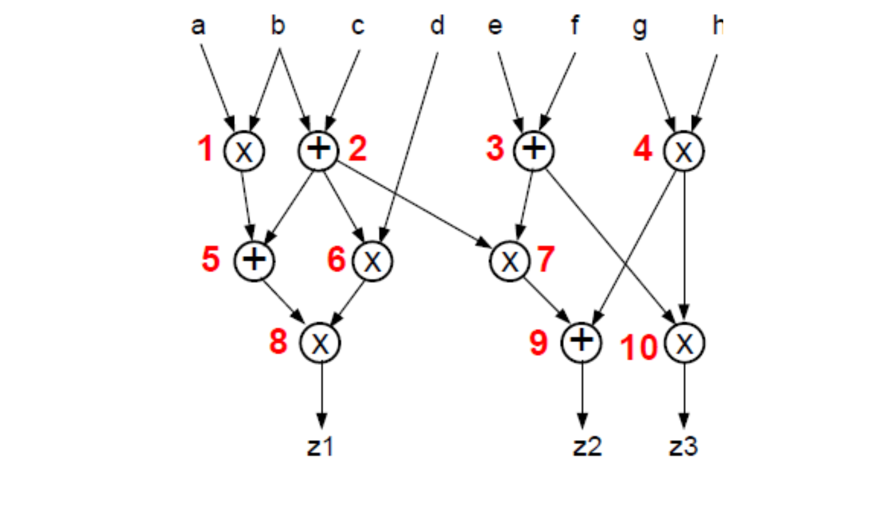

# High Level Synthesis
---
This work is about HLS course, Duth ECCE 9 Semester and contains 4 projects on High Level Synthesis working with C++ and  Catapult.
---

## Project 1
---
  In exercise 1 and 2 we have to write simple  C++ code and in exercise 3 we work with a data flow graph.In addition,  src file contains testing.cpp which is a testbench file for ex1.cpp and ex2.cpp.

-  **Exercise 1**: Write  function, c++ code that computes the  sum of each row of a 2-D array.The sum of the elements of the i-th row appears in the position i of the row_sum table.  
  
          template<int N,int M>
          void compute_row_sum(short a[N][M], short row_sum[N])
 

- **Exercise 2**: We have to apply wave sort in 1-D array on two steps.
    - Step 1: Apply sorting algorithm.
  
    - Step 2: Run  through all the elements of the table and change the positions of the neighbouring elements every two.  
     
           template<int N>
           void wave_sort(int a[N]) 
     

- **Exercise 3:** We have the following data flow graph.
  
  
   
   - a. We consider that multiplication requires 2 units of time and addition requires one. Also assume that we have as much material as we need. Time the graph operations (either with an ASAP algorithm ) so that the clock period does not exceed two units of time and the calculation is completed in less than 9 clock cycles.
  
  - b. Then we consider that we have at our disposal only one adder and two multipliers and the same limitation on the frequency of the clock. Repeat the scheduling of the calculation graph (we can use any resource constrained scheduling algorithm - resource constrained scheduling). Finally, show which operators of the graph (using the numbers next to each node) are calculated from which numeric unit of the three available to us.
   

  

       
      

## Project 2
---

- In this project we have to use wavesort function we implemented on **Project 1** , but with bubble sort algorithm. In addition we have to write a main function for testing our code.
  
- For Catapult now we have to to make the following steps :  
     
     - 1. In the hierarchy stage you will select as top module  the function that implements wavesort.
    
     - 2. In the libraries stage we ensure that we select libraries for RAM.
        
     - 3. In the mapping stage we set a **500MHz** frequency clock.

     - 4. In the architecture stage, we have to set the input/output interface  to be a memory  with a read port and a write port **1R1W**. We select "ccs_sample_mem.ccs_ram_sync_1R1W or  ram_nangate-45nm-separate_beh.RAM_separateRW".

     - 5. We make RTL and we verify the correctness of the circuit through co-simulation.

 

## Project 3
---

This set-project is about identifying the dependencies that occur in a circuit that do not allow pipelining and transforming the loops to succesfully merge them.

- **Exercise 1**  
  
  The function compute_row_sum computes the sum of each row of arrat a.
         
         template<int N>
         void compute_row_sum(short a[N][M], short row_sum[N]) {
             ROW: for (int i=0; i<N; i++){
                  row_sum[i]=0;
                  SUM: for (int j=0; j<M; j++){
                       row_sum[i]+=a[i][j];
                  }
                  }
                  }

  We implement  this function via HLS  on hardware under the  following conditions:
   
     -  1. The circuit interface will include two separate memory interfaces of 16bit each , **1R1W**.
  
     -  2. We compose our circuit by aiming for **500MHz** in **45nm** technology. What is the total execution time in cycles?
  
     -  3. We change the architecture of the circuit, pipelining the ROW and SUM iterations, with an Inititation Interval of 1. Why can't this be achieved?
   
    -  4. We have to change c++ to achieve step 3.
  
    -  5. After changes our circuit should go through the RTL simulation (co-simulation). We observe the differencers in the simulation times.
  

 

- **Exercise 2**  
  
  The following function computes Fibonacci sequence.

    $$ fib[i]=fib[i-1]+fib[i-2],\ fib[0]=fib[1]=1. $$

        
          template<int N>
          void fibonacci(int fib[N]) {
              LOOP: for (int i = 0; i < N; i++) {
                   if (i < 2) {
                       fib[i] = 1;
                   } else {
                       fib[i] = fib[i-1] + fib[i-2];
                       }
                    }
                 }    
  
   

  We implement  this function via HLS  on hardware under the  following conditions:
     
    - 1. We compose our circuit by aiming for **500MHz** in **45nm** technology.
      
    - 2. The Interface of the circuit  must be one memory 32bit type **1R1W**.

    - 3. We apply pipeline with initiation interval 1 in loop LOOP.
  

  We have to change the architecture of the circuit because we have problem.After changes our circuit should go through the RTL simulation (co-simulation).

- **Exercise 3**  
    
    The following function computes the sum of two elements of vectors :
         

         void two_loops(int A[10],int B[100], int &res){
               int sum=0;
               LOOP1: for(int i=0; i<10; i++){

                     sum+=A[i];
                  }

               LOOP2: for(int i=0; i<100; i++){
                      
                      sum+=B[i];
                      }

              res=sum;
            
               }

     

  We implement  this function via HLS  on hardware under the  following conditions:

    - 1. We compose our circuit by aiming for **500MHz** in **45nm** technology.
       
    - 2. The interface of the circuit should consist of two 32bit memory interfaces (one for
for table A and one for table B), of type 1R1W.

  
  As we observe on scheduling, Catapult cannot merge the two loops into one. This is due both to the different boundaries of the two loops, and to dependencies between them when calculating the sum. We have to transform C++ so that Catapult manages to merge the two loops. 

       
   
  
